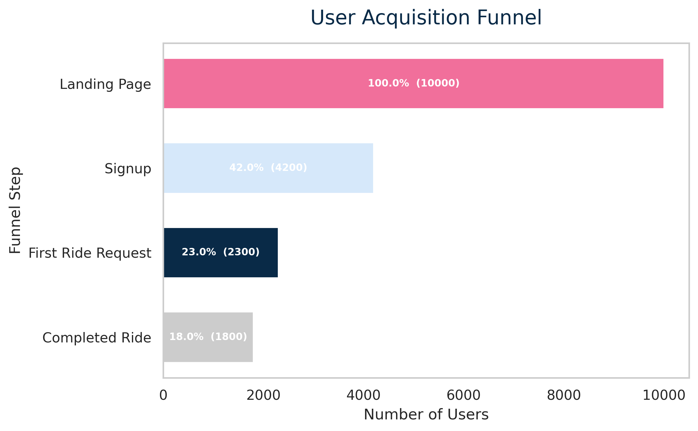
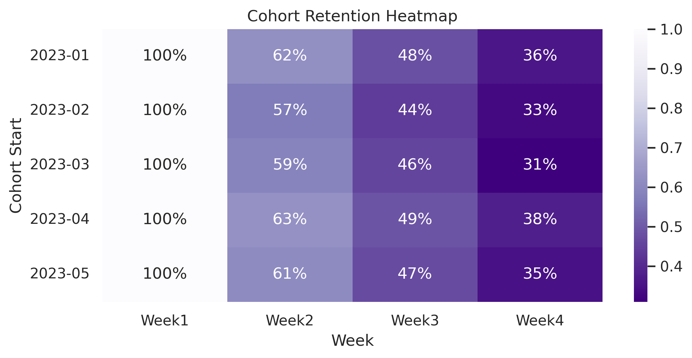

Metrocar – Funnel & Retention Analytics

This project demonstrates an end-to-end growth funnel and retention analysis using simulated data from a fictional ride-sharing company, Metrocar.  
It replicates a typical growth analytics workflow — from SQL-style exploration to Python-based visualization — to identify key bottlenecks and retention patterns in the user lifecycle.

All results are reproducible and based on publicly shareable, simulated data.

---

Project Overview

- Goal: Identify drop-off points in the user acquisition funnel and evaluate customer retention patterns over time.  
- Focus: Conversion, activation, and early user engagement.  
- Techniques:  
  - Funnel metrics calculation and visualization  
  - Cohort-based retention analysis  
  - Business KPI interpretation (conversion, retention, engagement)  
- Tools: Python, Pandas, Seaborn, Plotly, Matplotlib

---

Key Visualizations

| Visualization | Description |
|----------------|-------------|
| User Funnel Chart | Visualizes conversion from first visit to completed ride |
| Cohort Retention Heatmap | Displays week-over-week user retention by cohort |

